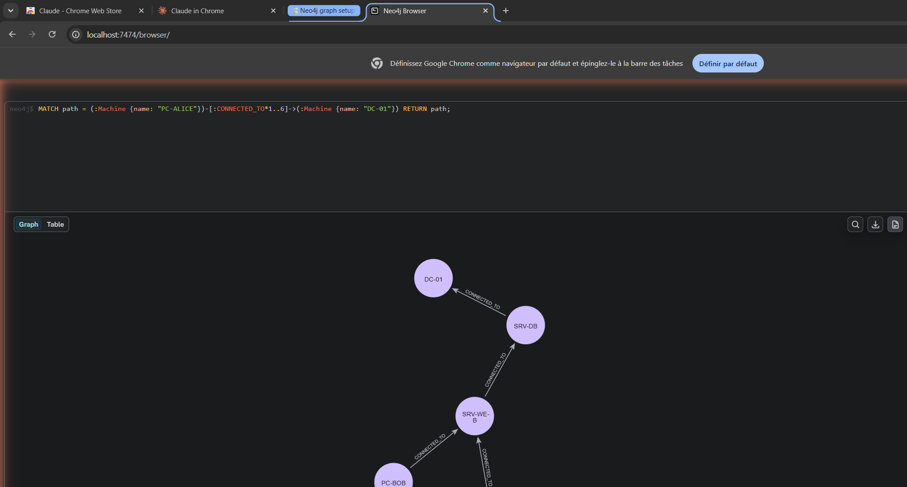
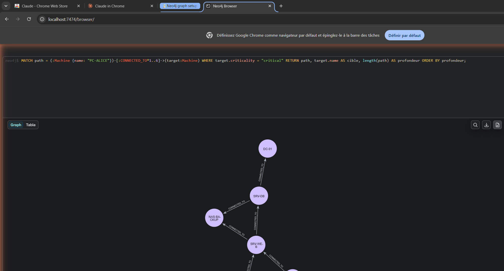
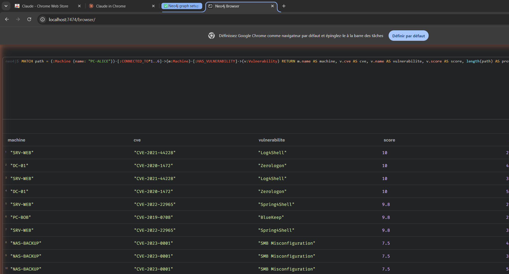
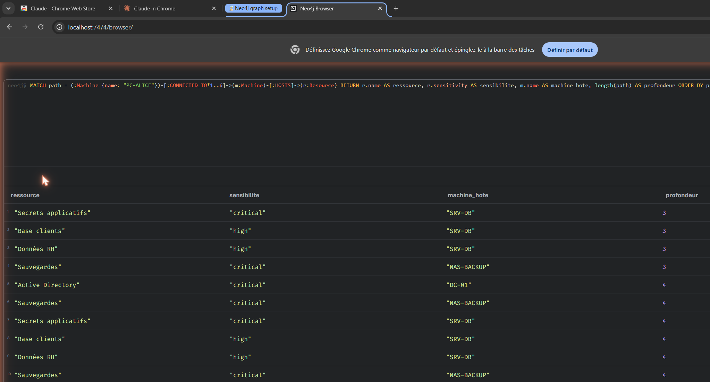
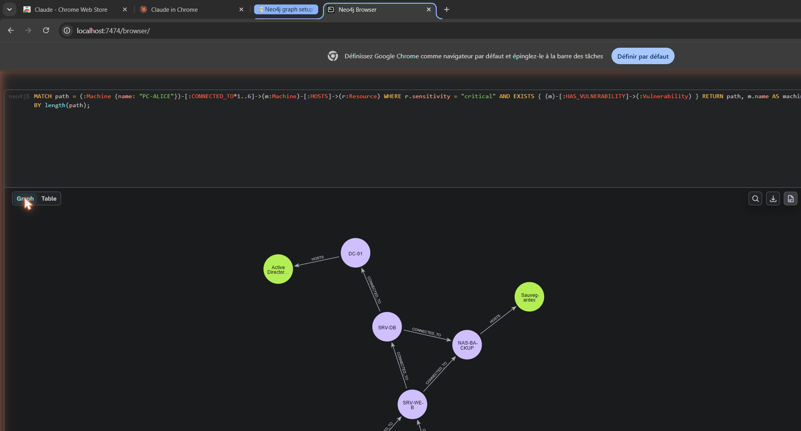
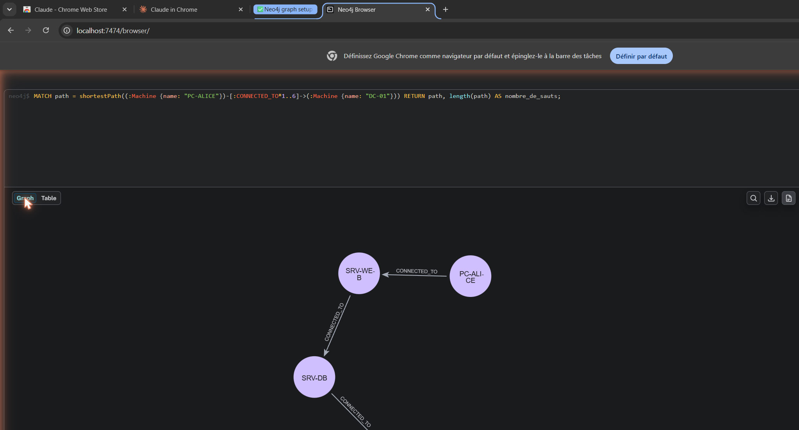
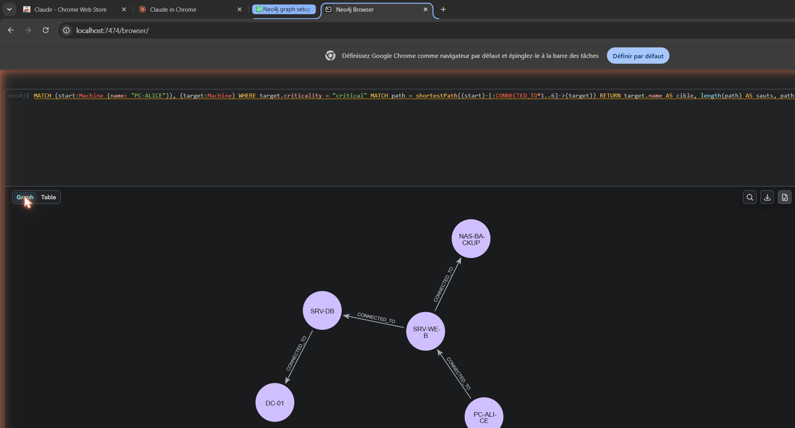
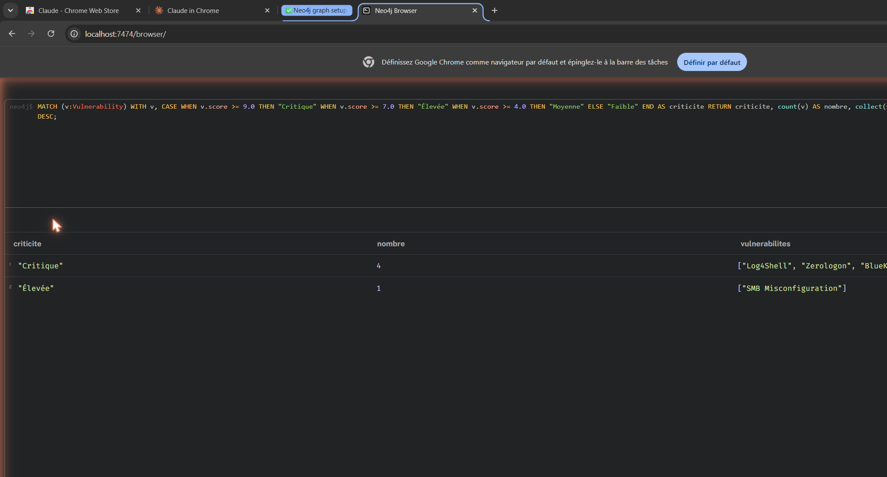
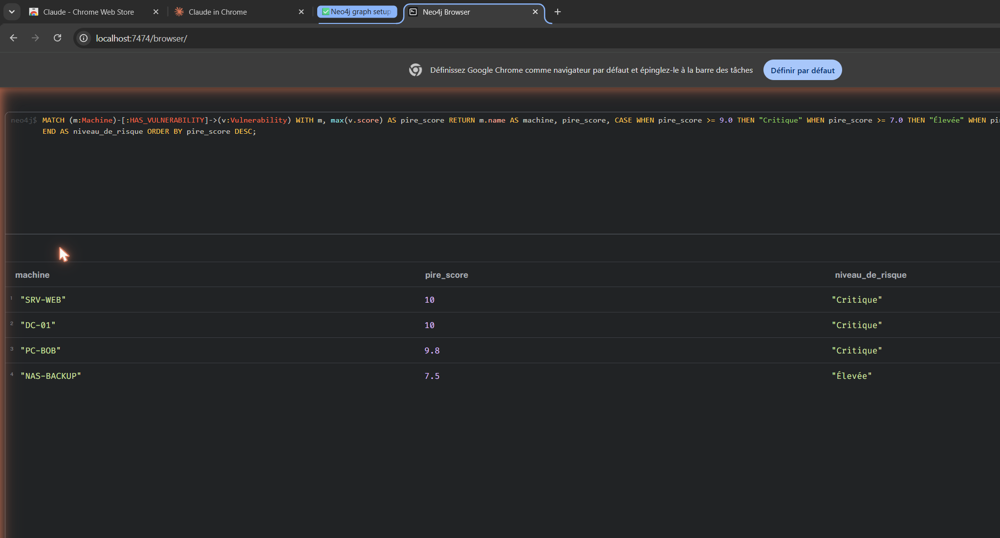
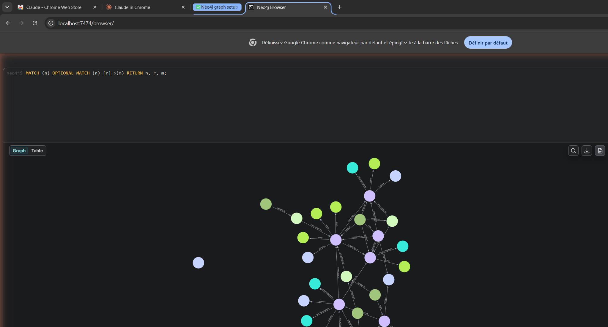

# Analyse des chemins d'attaque — CyberCorp (Neo4j)

## Contexte

Le poste **PC-ALICE** a été compromis à la suite d'une attaque par phishing.
À partir de ce point d'entrée, on utilise Neo4j pour cartographier les chemins
possibles vers les ressources critiques de l'entreprise, identifier les machines
vulnérables sur ces chemins, et prioriser le risque.

Le graphe (`seed.cypher`) contient **32 nœuds** et **43 relations** :

| Label | Nombre | | Relation | Nombre |
|---|---|---|---|---|
| Machine | 7 | | CONNECTED_TO | 10 |
| Service | 6 | | EXPOSES | 6 |
| User | 5 | | HAS_VULNERABILITY | 5 |
| Vulnerability | 5 | | HAS_ACCESS_TO | 5 |
| Resource | 5 | | HOSTS | 5 |
| Group | 4 | | MEMBER_OF | 5 |
| | | | USES | 4 |
| | | | ADMIN_OF | 3 |

> **Note d'orthographe** : le label utilisé est `Resource` (anglais), avec la propriété
> `sensitivity`. C'est cohérent avec `seed.cypher` et `requetes_analyse.cypher`.
> Une ancienne capture du dépôt (`Livrables/Requêtes Cypher/req_cypher.md`) montrait
> `Ressource` (français) — cette orthographe est à éviter pour que les requêtes
> retrouvent bien les ressources.

---

## 1. Chemins d'accès de PC-ALICE vers DC-01

Tous les chemins (longueur 1 à 6) reliant le poste compromis au contrôleur de domaine.

```cypher
MATCH path = (:Machine {name: "PC-ALICE"})-[:CONNECTED_TO*1..6]->(:Machine {name: "DC-01"})
RETURN path;
```



**Résultat :** plusieurs chemins existent, tous transitant par `SRV-WEB` puis `SRV-DB`
avant d'atteindre `DC-01`.

---

## 2. Chemins vers toutes les machines critiques

```cypher
MATCH path = (:Machine {name: "PC-ALICE"})-[:CONNECTED_TO*1..6]->(target:Machine)
WHERE target.criticality = "critical"
RETURN path, target.name AS cible, length(path) AS profondeur
ORDER BY profondeur;
```



**Résultat :** les deux machines `critical` — `DC-01` et `NAS-BACKUP` — sont toutes
deux atteignables depuis PC-ALICE.

---

## 3. Machines vulnérables sur les chemins d'attaque

Croisement des chemins avec les vulnérabilités connues (vue tableau).

```cypher
MATCH path = (:Machine {name: "PC-ALICE"})-[:CONNECTED_TO*1..6]->(m:Machine)-[:HAS_VULNERABILITY]->(v:Vulnerability)
RETURN m.name AS machine, v.cve AS cve, v.name AS vulnerabilite, v.score AS score, length(path) AS profondeur
ORDER BY v.score DESC;
```



**Résultat :** `SRV-WEB` (Log4Shell 10, Spring4Shell 9.8), `DC-01` (Zerologon 10),
`PC-BOB` (BlueKeep 9.8) et `NAS-BACKUP` (SMB Misconfiguration 7.5) sont atteignables
et vulnérables.

---

## 4. Ressources exposées via les chemins

```cypher
MATCH path = (:Machine {name: "PC-ALICE"})-[:CONNECTED_TO*1..6]->(m:Machine)-[:HOSTS]->(r:Resource)
RETURN r.name AS ressource, r.sensitivity AS sensibilite, m.name AS machine_hote, length(path) AS profondeur
ORDER BY profondeur;
```



**Résultat :** les ressources `Secrets applicatifs`, `Base clients`, `Données RH`
(sur `SRV-DB`), `Active Directory` (sur `DC-01`) et `Sauvegardes` (sur `NAS-BACKUP`)
sont toutes atteignables depuis le poste compromis.

---

## 5. Chemins vers des ressources critiques hébergées sur une machine vulnérable

Le scénario le plus dangereux : une ressource `critical` sur une machine qui possède
au moins une vulnérabilité.

```cypher
MATCH path = (:Machine {name: "PC-ALICE"})-[:CONNECTED_TO*1..6]->(m:Machine)-[:HOSTS]->(r:Resource)
WHERE r.sensitivity = "critical" AND EXISTS { (m)-[:HAS_VULNERABILITY]->(:Vulnerability) }
RETURN path, m.name AS machine_hote, r.name AS ressource_critique
ORDER BY length(path);
```



**Résultat :** `Active Directory` (DC-01) et `Sauvegardes` (NAS-BACKUP), tous deux
`critical`, sont hébergés sur des machines vulnérables et accessibles depuis PC-ALICE.

---

## 6. Chemin le plus court vers DC-01

```cypher
MATCH path = shortestPath((:Machine {name: "PC-ALICE"})-[:CONNECTED_TO*1..6]->(:Machine {name: "DC-01"}))
RETURN path, length(path) AS nombre_de_sauts;
```



**Résultat :** le chemin le plus court est **PC-ALICE → SRV-WEB → SRV-DB → DC-01**,
soit **3 sauts**.

---

## 7. Chemins les plus courts vers toutes les cibles critiques

```cypher
MATCH (start:Machine {name: "PC-ALICE"}), (target:Machine)
WHERE target.criticality = "critical"
MATCH path = shortestPath((start)-[:CONNECTED_TO*1..6]->(target))
RETURN target.name AS cible, length(path) AS sauts, path
ORDER BY sauts;
```



**Résultat :** `NAS-BACKUP` est atteignable en 2 sauts et `DC-01` en 3 sauts.

---

## 8. Classification des vulnérabilités par criticité (CVSS)

```cypher
MATCH (v:Vulnerability)
WITH v,
     CASE
       WHEN v.score >= 9.0 THEN "Critique"
       WHEN v.score >= 7.0 THEN "Élevée"
       WHEN v.score >= 4.0 THEN "Moyenne"
       ELSE "Faible"
     END AS criticite
RETURN criticite, count(v) AS nombre, collect(v.name) AS vulnerabilites
ORDER BY nombre DESC;
```



**Résultat :** **4 vulnérabilités Critiques** (Log4Shell, Zerologon, BlueKeep,
Spring4Shell) et **1 Élevée** (SMB Misconfiguration).

---

## 9. Classification des machines par niveau de risque

```cypher
MATCH (m:Machine)-[:HAS_VULNERABILITY]->(v:Vulnerability)
WITH m, max(v.score) AS pire_score
RETURN m.name AS machine, pire_score,
       CASE
         WHEN pire_score >= 9.0 THEN "Critique"
         WHEN pire_score >= 7.0 THEN "Élevée"
         WHEN pire_score >= 4.0 THEN "Moyenne"
         ELSE "Faible"
       END AS niveau_de_risque
ORDER BY pire_score DESC;
```



**Résultat :** `SRV-WEB` et `DC-01` (score 10) et `PC-BOB` (9.8) sont classés
**Critique** ; `NAS-BACKUP` (7.5) est **Élevé**.

---

## 10. Vue d'ensemble du graphe

Cartographie complète du système d'information (nœuds + relations), colorée par label.

```cypher
MATCH (n) OPTIONAL MATCH (n)-[r]->(m) RETURN n, r, m;
```



---

## Synthèse et recommandations

- Depuis un seul poste compromis (**PC-ALICE**), l'ensemble des ressources critiques
  de CyberCorp est atteignable — notamment **Active Directory** (DC-01, 3 sauts) et
  les **Sauvegardes** (NAS-BACKUP, 2 sauts).
- Les chemins passent systématiquement par **SRV-WEB**, machine porteuse de deux
  vulnérabilités critiques (Log4Shell, Spring4Shell) : c'est le **maillon prioritaire
  à corriger** pour casser la propagation.
- **Zerologon** (CVE-2020-1472) sur le contrôleur de domaine et **BlueKeep**
  (CVE-2019-0708) sur PC-BOB doivent être patchés en urgence.
- Recommandations : segmentation réseau pour supprimer les liens `CONNECTED_TO`
  directs vers les machines critiques, application des correctifs sur SRV-WEB /
  DC-01 / PC-BOB, durcissement du partage SMB sur NAS-BACKUP.
