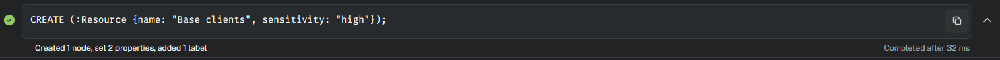
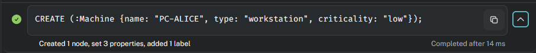
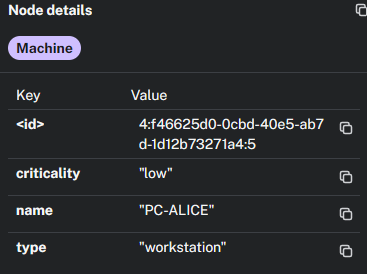
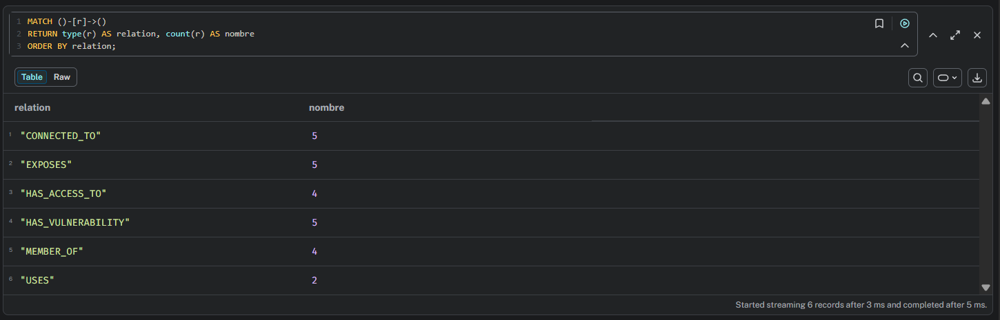
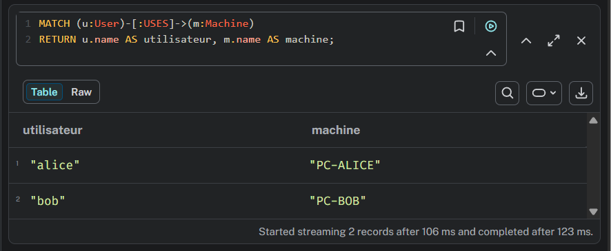
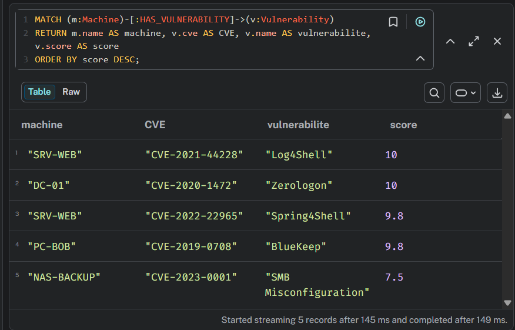
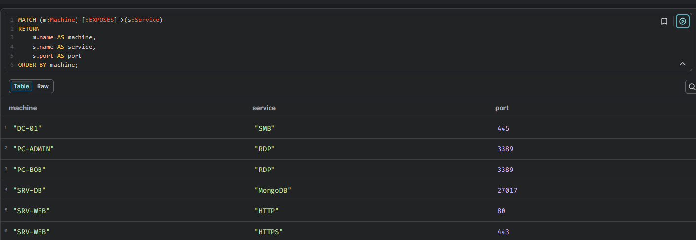
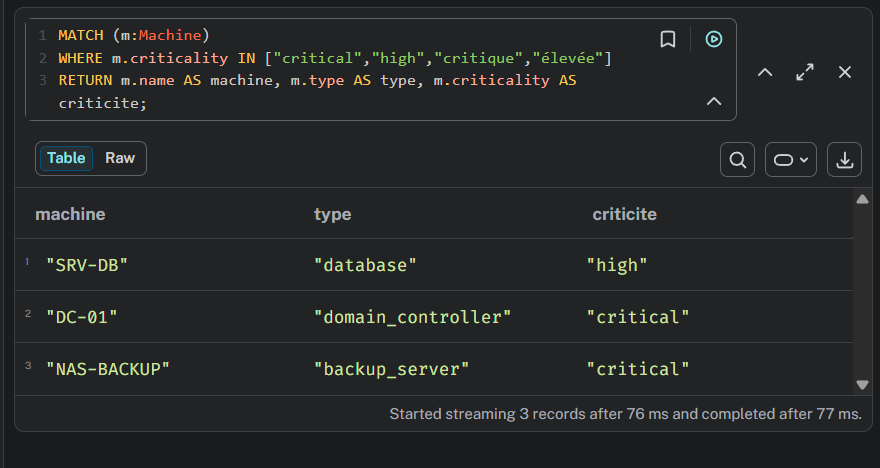
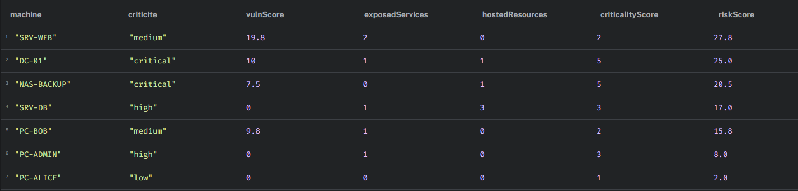

# Requêtes Cypher - Livrable

## Requêtes de création

### 1. Création d’une ressource
La requête ci-dessous crée un nœud de label `Ressource` pour "Base clients" et ajoute la propriété `sensitivity` avec la valeur "High".



**Résultat :**


---

### 2. Création d’une machine
La requête ci-dessous crée un nœud de label `Machine` pour "PC-ALICE" et définit les propriétés `type` sur `workstation` et `criticality` sur `low`.



**Résultat :**



---

### 3. Création d’un service
La requête ci-dessous crée un nœud de label `Service` pour "SSH" et ajoute la propriété `port` avec la valeur "22".


**Résultat :**


## Requêtes d'analyses 

# Création des relations

Avant d'exécuter les requêtes d'analyse, les relations entre les différents nœuds ont été créées afin de représenter le fonctionnement du système d'information (utilisateurs, machines, groupes, services, vulnérabilités et ressources).

### Vérification

```cypher
MATCH ()-[r]->()
RETURN type(r) AS relation, count(r) AS nombre
ORDER BY relation;
```

### Résultat



## 1. Afficher les utilisateurs et leurs machines

### Objectif

Cette requête permet d'identifier la machine utilisée par chaque utilisateur du système d'information.

### Requête

```cypher
MATCH (u:User)-[:USES]->(m:Machine)
RETURN
    u.name AS utilisateur,
    m.name AS machine;
```

### Résultat



### Analyse

Cette requête permet de vérifier l'association entre les utilisateurs et leurs postes de travail. Elle permet notamment de confirmer que la machine **PC-ALICE** est utilisée par l'utilisateur **alice**, qui constitue le point de départ du scénario d'attaque.

---

# 2. Afficher les machines vulnérables

### Objectif

Identifier les machines possédant des vulnérabilités connues.

### Requête

```cypher
MATCH (m:Machine)-[:HAS_VULNERABILITY]->(v:Vulnerability)
RETURN
    m.name AS machine,
    v.cve AS CVE,
    v.name AS vulnerabilite,
    v.score AS score
ORDER BY score DESC;
```

### Résultat



### Analyse

Cette requête met en évidence les vulnérabilités présentes sur les différentes machines. Le tri par score CVSS permet de faire apparaître en premier les vulnérabilités les plus critiques, qui représentent les risques les plus importants pour l'entreprise.

---

# 3. Afficher les services exposés

### Objectif

Lister les services réseau exposés par chaque machine.

### Requête

```cypher
MATCH (m:Machine)-[:EXPOSES]->(s:Service)
RETURN
    m.name AS machine,
    s.name AS service,
    s.port AS port
ORDER BY machine;
```

### Résultat



### Analyse

Les services exposés représentent la surface d'attaque du système d'information. Cette requête permet d'identifier rapidement quelles machines proposent des services accessibles comme HTTP, HTTPS, RDP, SMB ou MongoDB.

---

# 4. Afficher les machines critiques

### Objectif

Identifier les machines ayant la criticité la plus élevée.

### Requête

```cypher
MATCH (m:Machine)
WHERE m.criticality IN ["critical","high","critique","élevée"]
RETURN
    m.name AS machine,
    m.type AS type,
    m.criticality AS criticite;
```

### Résultat



### Analyse

Cette requête permet de repérer les machines qui nécessitent le plus haut niveau de protection, comme le contrôleur de domaine, le serveur de base de données ou le serveur de sauvegarde.

---

# 5. Score de risque par machine (Bonus)

### Objectif

Calculer un score de risque global pour chaque machine à partir de plusieurs critères :

- criticité ;
- vulnérabilités ;
- services exposés ;
- ressources hébergées.

### Requête

```cypher
MATCH (m:Machine)

OPTIONAL MATCH (m)-[:HAS_VULNERABILITY]->(v:Vulnerability)
WITH
    m,
    coalesce(sum(v.score),0) AS vulnScore

OPTIONAL MATCH (m)-[:EXPOSES]->(s:Service)

WITH
    m,
    vulnScore,
    count(s) AS exposedServices

OPTIONAL MATCH (m)-[:HOSTS]->(r:Resource)

WITH
    m,
    vulnScore,
    exposedServices,
    count(r) AS hostedResources,

CASE m.criticality
WHEN "low" THEN 1
WHEN "medium" THEN 2
WHEN "high" THEN 3
WHEN "critical" THEN 5
WHEN "faible" THEN 1
WHEN "moyenne" THEN 2
WHEN "élevée" THEN 3
WHEN "critique" THEN 5
ELSE 1
END AS criticalityScore

RETURN

m.name AS machine,

m.criticality AS criticite,

vulnScore,

exposedServices,

hostedResources,

criticalityScore,

round(
vulnScore +
(exposedServices*2) +
(hostedResources*3) +
(criticalityScore*2),
2
) AS riskScore

ORDER BY riskScore DESC;
```

### Résultat



### Analyse

Cette requête calcule un score de risque pour chaque machine du système d'information. Le score est obtenu en combinant la criticité de la machine, les vulnérabilités présentes, les services exposés et les ressources sensibles hébergées. Les machines ayant le score le plus élevé représentent les cibles prioritaires pour les actions de sécurisation.

---

# Conclusion

Les différentes requêtes d'analyse permettent d'obtenir une vision globale du système d'information modélisé dans Neo4j.

Elles mettent en évidence :

- les utilisateurs et leurs postes ;
- les vulnérabilités présentes ;
- les services accessibles ;
- les machines critiques ;
- les machines présentant le niveau de risque le plus élevé.

Ces informations facilitent l'identification des éléments les plus sensibles de l'infrastructure et permettent de prioriser les actions de remédiation afin de réduire la surface d'attaque du système d'information.