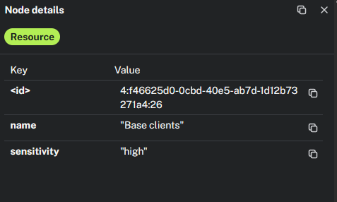
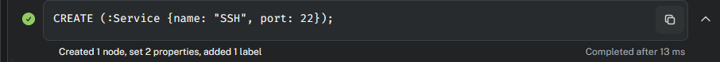
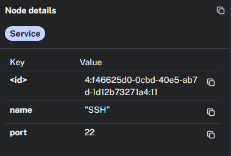

# Requêtes Cypher - Livrable

## Requêtes de création

### 1. Création d’une ressource
La requête ci-dessous crée un nœud de label `Ressource` pour "Base clients" et ajoute la propriété `sensitivity` avec la valeur "High".

**Résultat :**

---

### 2. Création d’une machine
La requête ci-dessous crée un nœud de label `Machine` pour "PC-ALICE" et définit les propriétés `type` sur `workstation` et `criticality` sur `low`.

**Résultat :**

---

### 3. Création d’un service
La requête ci-dessous crée un nœud de label `Service` pour "SSH" et ajoute la propriété `port` avec la valeur "22".

**Résultat :**

## Requêtes d'analyses 

